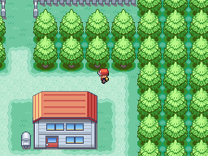

# Unreal Time System
This script is for Pokémon Essentials. It makes the time in game uses its own clock that only pass when you are in game instead of using real time (like Minecraft and Zelda: Ocarina of Time).

## Screens

## Installation
Follow the [Script](/Script.rb) instructions.